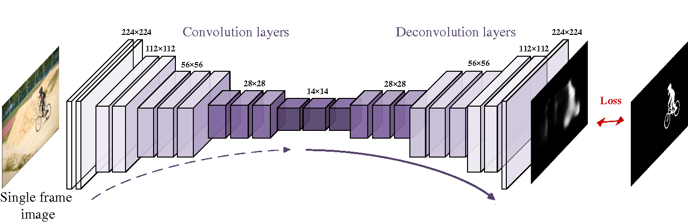
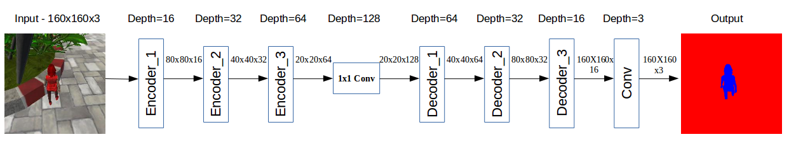
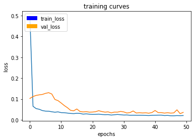

[](https://www.udacity.com/robotics)

## Deep Learning Project ##

In this project, a deep neural network is trained to identify and track a target in simulation. So-called “follow me” applications like this are key to many fields of robotics and the very same techniques that are applied here could be extended to scenarios like advanced cruise control in autonomous vehicles or human-robot collaboration in industry.

[image_0]: ./docs/misc/sim_screenshot.png
![alt text][image_0] 

## Setup Instructions
**Clone the repository**
```
$ git clone https://github.com/navinrahim/RoboND-DeepLearning.git
```

**The data**

Save the following three files into the data folder of the cloned repository. 

[Training Data](https://s3-us-west-1.amazonaws.com/udacity-robotics/Deep+Learning+Data/Lab/train.zip) 

[Validation Data](https://s3-us-west-1.amazonaws.com/udacity-robotics/Deep+Learning+Data/Lab/validation.zip)

[Sample Evaluation Data](https://s3-us-west-1.amazonaws.com/udacity-robotics/Deep+Learning+Data/Project/sample_evaluation_data.zip)

Note: The `train.zip` when extracted gives a `train_combined` folder which has to be renamed to `train`.

**Download the QuadSim binary**

To interface the neural net with the QuadSim simulator, you must use a version of QuadSim that has been custom tailored for this project.

The simulator binary can be downloaded [here](https://github.com/udacity/RoboND-DeepLearning/releases/latest)

**Install Dependencies**

You'll need Python 3 and Jupyter Notebooks installed to do this project.  The best way to get setup with these if you are not already is to use Anaconda following along with the [RoboND-Python-Starterkit](https://github.com/udacity/RoboND-Python-StarterKit).

If for some reason you choose not to use Anaconda, you must install the following frameworks and packages on your system:
* Python 3.x
* Tensorflow 1.2.1
* NumPy 1.11
* SciPy 0.17.0
* eventlet 
* Flask
* h5py
* PIL
* python-socketio
* scikit-image
* transforms3d
* PyQt4/Pyqt5

## Implementation of the Segmentation Network
1. Download the training dataset from above and extract to the project `data` directory.
2. The solution was implemented in [`model_training.ipynb`](./code/model_training.ipynb)
3. Train the network locally, or on [AWS](https://classroom.udacity.com/nanodegrees/nd209/parts/09664d24-bdec-4e64-897a-d0f55e177f09/modules/cac27683-d5f4-40b4-82ce-d708de8f5373/lessons/197a058e-44f6-47df-8229-0ce633e0a2d0/concepts/27c73209-5d7b-4284-8315-c0e07a7cd87f?contentVersion=1.0.0&contentLocale=en-us). This network was trained using a Nvidia GTX Titan XP GPU card on the local system.
4. Continue to experiment with the training data and network until you attain the score you desire.
5. Once a comfortable performance on the training dataset is obtained, see how it performs in live simulation!

## Collecting Training Data ##
A simple training dataset has been provided in this project's repository. This dataset will allow you to verify that your segmentation network is semi-functional. However, if your interested in improving your score,you may want to collect additional training data. To do it, please see the following steps.

The data directory is organized as follows:
```
data/runs - contains the results of prediction runs
data/train/images - contains images for the training set
data/train/masks - contains masked (labeled) images for the training set
data/validation/images - contains images for the validation set
data/validation/masks - contains masked (labeled) images for the validation set
data/weights - contains trained TensorFlow models

data/raw_sim_data/train/run1
data/raw_sim_data/validation/run1
```

### Training Set ###
1. Run QuadSim
2. Click the `DL Training` button
3. Set patrol points, path points, and spawn points. The buttons to add these can be found in the Quadsim's legend option.
3. With the simulator running, press "r" to begin recording.
4. In the file selection menu navigate to the `data/raw_sim_data/train/run1` directory
5. **optional** to speed up data collection, press "9" (1-9 will slow down collection speed)
6. When you have finished collecting data, hit "r" to stop recording.
7. To reset the simulator, hit "`<esc>`"
8. To collect multiple runs create directories `data/raw_sim_data/train/run2`, `data/raw_sim_data/train/run3` and repeat the above steps.


### Validation Set ###
To collect the validation set, repeat both sets of steps above, except using the directory `data/raw_sim_data/validation` instead rather than `data/raw_sim_data/train`.

### Image Preprocessing ###
Before the network is trained, the images first need to be undergo a preprocessing step. The preprocessing step transforms the depth masks from the sim, into binary masks suitable for training a neural network. It also converts the images from .png to .jpeg to create a reduced sized dataset, suitable for uploading to AWS. 
To run preprocessing:
```
$ python preprocess_ims.py
```
**Note**: If your data is stored as suggested in the steps above, this script should run without error.

**Important Note 1:** 

Running `preprocess_ims.py` does *not* delete files in the processed_data folder. This means if you leave images in processed data and collect a new dataset, some of the data in processed_data will be overwritten some will be left as is. It is recommended to **delete** the train and validation folders inside processed_data(or the entire folder) before running `preprocess_ims.py` with a new set of collected data.

**Important Note 2:**

The notebook, and supporting code assume your data for training/validation is in data/train, and data/validation. After you run `preprocess_ims.py` you will have new `train`, and possibly `validation` folders in the `processed_ims`.
Rename or move `data/train`, and `data/validation`, then move `data/processed_ims/train`, into `data/`, and  `data/processed_ims/validation`also into `data/`

**Important Note 3:**

Merging multiple `train` or `validation` may be difficult, it is recommended that data choices be determined by what you include in `raw_sim_data/train/run1` with possibly many different runs in the directory. You can create a temporary folder in `data/` and store raw run data you don't currently want to use, but that may be useful for later. Choose which `run_x` folders to include in `raw_sim_data/train`, and `raw_sim_data/validation`, then run  `preprocess_ims.py` from within the 'code/' directory to generate your new training and validation sets. 

## Model ##
The primary task of this project is to identify and follow a person using a quadroptor in simulation. A semantic segmentation approach was selected for this purpose that accurately classifies each pixel in the image from the quadroptor as the person to be followed or not.

A semantic segmentation network should take an input image, extract features from it and return the same shaped image as output with every pixel classified accordingly. For this purpose, a fully convolutional network(FCN) is used. This consists of only convolutional layers. They slide through the previous image and extracts features. These are later upsampled to the image size that then has the classifications. The feature extraction part is called an encoder and the upsampling part is called a decoder. 


[Image Source](https://www.doc.ic.ac.uk/~jce317/content-images/SegmentationDiagram1.png)

Typically, a 1x1 convolution is placed in between these, as it helps in extracting features from the encode with less parameters and thus faster execution. Conceptually, the 1x1 convolution is a replacement of the fully connected layers that are used in typical convolutional networks. The replacement with 1x1 convolution makes the execution faster, with lesser parameters with an added advantage that any shaped input can now be provided to the network. This is because, a fully connected network expects a fixed input shape while a convolution does not require this.

### Seperable convolutions
A typical convolutional network contains an input, a kernel that goes through the input and adds the values across depth to obtain a single layer of features.


[Image Source](http://machinelearninguru.com/_images/topics/computer_vision/basics/convolutional_layer_1/rgb.gif)

From the above image, input is of size, 5x5x3 and a kernel of 3x3x3 is slided across it, multiplied and added to get one layer in output. Say, we need such 9 output layers, which are also referred as 9 filters, we need 9 3x3x3 filters. This requires 9x3x3x3 parameters, which is 243 parameters.

A seperable convolution comes in to picture to reduce this high number of parameters. Here, we just use one kernel as shown in the image, but instead of adding them to form one layer, we keep it as an output of depth 3 itself and run required number of 1x1 convolutions over it. Thus, we use 1 3x3x3 kernel and 9 1x1 convolutions. This reduces the number of parameters to 3x3x3 + 9x1x1x3 = 54 parameters.

This was used for the encoder blocks in the code for this project.
```py
def separable_conv2d_batchnorm(input_layer, filters, strides=1):
    output_layer = SeparableConv2DKeras(filters=filters,kernel_size=3, strides=strides, padding='same', activation='relu')(input_layer)
    
    output_layer = layers.BatchNormalization()(output_layer) 
    return output_layer
```

A batch normalization layer is added to normalize the values before passing the output to next layer with inputs that are zero mean/unit variance. This imporves the performance and stability of the network. 

### 1x1 Convolution
As mentioned before, 1x1 convolution can be thought of as replacing the fully connected networks, but since it is a convolution it retains spatial information with lesser parameters and can take in any sized input. It thus results in faster execution.

It is also a very inexpensive way to deepen the network compared to the fully connected network. Spatial information is reserved as there is no flattening of inputs as required in fully connected networks. 

1x1 convolution helps in reducing the dimensionality of the input layer. A fully-connected layer of the same size would result in the same number of features. However, replacement of fully-connected layers with convolutional layers presents an added advantage that during inference (testing your model), we can feed images of any size into your trained network.

This feature of 1x1 convolution is used after the decoder to extract more features and pass it on to the decoder of the network.

```py
def conv2d_batchnorm(input_layer, filters, kernel_size=3, strides=1):
    output_layer = layers.Conv2D(filters=filters, kernel_size=kernel_size, strides=strides, padding='same', activation='relu')(input_layer)
    
    output_layer = layers.BatchNormalization()(output_layer) 
    return output_layer
```
As before, a batch normalization layer is also added after the 1x1 convolution layer.

### Encoder and Decoder layer
One encoder layer contains one seperable convolution followed by a batch normalization layer.
```py
def encoder_block(input_layer, filters, strides):

    output_layer = separable_conv2d_batchnorm(input_layer, filters, strides)
    
    return output_layer
```

The encoder layer extracts features from the previous layers. This information is then to be upsampled to the original image size. This process may result in losing some finer details. Inorder to retain such information, we can concatenate the previous encoder layers while upsampling. 

The decoder thus contains bilinear upsampling the previous layer and concatenating an encoder layer. An additional seperable convolution is also used after this to extract some more spatial information from prior layers.

```py
def decoder_block(small_ip_layer, large_ip_layer, filters):
    
    # Upsample the small input layer using the bilinear_upsample() function.
    upsample_layer = bilinear_upsample(small_ip_layer)
    
    # Concatenate the upsampled and large input layers using layers.concatenate
    concatenate_layer = layers.concatenate([upsample_layer,large_ip_layer])
    
    # Add some number of separable convolution layers
    output_layer = separable_conv2d_batchnorm(concatenate_layer, filters, strides=1)
    
    return output_layer
```

### Model architecture

The model was built step by step based on the resultant score on validation images. Layers were added one by one that resulted in increase in validation accuracy. Adding the layers help in capturing more features. Also, the hyperparameters were also tuned to obtain the desired result.

The model architecture used is shown in the below figure.


The below is the code for the same
```py
def fcn_model(inputs, num_classes):
    
    # Add Encoder Blocks. 
    # Remember that with each encoder layer, the depth of your model (the number of filters) increases.
    layer_1 = encoder_block(inputs, 16, 2)
    layer_2 = encoder_block(layer_1, 32, 2)
    layer_3 = encoder_block(layer_2, 64, 2)

    # Add 1x1 Convolution layer using conv2d_batchnorm().
    conv1_layer = conv2d_batchnorm(layer_3, 128, 1, 1)
    
    # Add the same number of Decoder Blocks as the number of Encoder Blocks
    decoder_layer_1 = decoder_block(conv1_layer, layer_2, 64)
    decoder_layer_2 = decoder_block(decoder_layer_1, layer_1, 32)
    x = decoder_block(decoder_layer_2, inputs, 16)

    
    # The function returns the output layer of your model. "x" is the final layer obtained from the last decoder_block()
    return layers.Conv2D(num_classes, 1, activation='softmax', padding='same')(x)
```

The approach taken here was to increase layers if the validation loss was not satisfiable. 

### Hyperparameters
The following hyperparameters were tuned for obtaining the desired result.

- **Learning Rate**: 0.001 was used as the learning rate at the start. The observation was long time for training the network. Thus, the learning rate was increased to  `0.1`.
- **Batch Size**: This is the number of images that will be propogated through the network in one forward pass. A batch size of `128` was selected for training the model. The local system had enough memory to load these many data for training.
- **Epochs**: This is the number of times the entire training dataset gets propagated through the network. The number of epochs was set to `50` and an `EarlyStopping` keras function was used to stop the training if the validation loss was not improved even after 10 epochs.
    ```py
    EarlyStopping(monitor='val_loss', patience=10)
    ```
- **Steps per Epoch**: This is the number of batches of training images that go through the network in 1 epoch. One recommended value to try would be based on the total number of images in training dataset divided by the batch_size. There was a total of 4131 images. Thus, a steps per epoch of `40` was used.
- **Validation Steps**: This is the number of batches of validation images that go through the network in 1 epoch. This is similar to steps_per_epoch, except validation_steps is for the validation dataset. This was set as `50`.
- **Workers**: This specifies the maximum number of processes to spin up. This can affect your training speed and is dependent on your hardware. This was set as `4` since it was trained on a local system with 8 cores.

The final parameter is summarized below:
```py
learning_rate = 0.01
batch_size = 128
num_epochs = 50
steps_per_epoch = 40
validation_steps = 50
workers = 4
```

## Training and Predicting ##
With your training and validation data having been generated or downloaded from the above section of this repository, you are free to begin working with the neural net.

**Note**: Training CNNs is a very compute-intensive process. If your system does not have a recent Nvidia graphics card, with [cuDNN](https://developer.nvidia.com/cudnn) and [CUDA](https://developer.nvidia.com/cuda) installed , you may need to perform the training step in the cloud. Instructions for using AWS to train your network in the cloud may be found [here](https://classroom.udacity.com/nanodegrees/nd209/parts/09664d24-bdec-4e64-897a-d0f55e177f09/modules/cac27683-d5f4-40b4-82ce-d708de8f5373/lessons/197a058e-44f6-47df-8229-0ce633e0a2d0/concepts/27c73209-5d7b-4284-8315-c0e07a7cd87f?contentVersion=1.0.0&contentLocale=en-us)

### Training your Model ###
**Prerequisites**
- Training data is in `data` directory
- Validation data is in the `data` directory
- The folders `data/train/images/`, `data/train/masks/`, `data/validation/images/`, and `data/validation/masks/` should exist and contain the appropriate data

To train the network, run the training cells in the [`model_training.ipynb`](./code/model_training.ipynb) notebook.

After the training run has completed, your model will be stored in the [`data/weights`](./data/weights) directory as an [HDF5](https://en.wikipedia.org/wiki/Hierarchical_Data_Format) file, and a configuration_weights file. As long as they are both in the same location, things should work. 

There is also a `best_model.h5` in the same folder which contains the best model obtained during the training with the best validation loss. This was obtained using the Keras `ModelCheckpoint` callback.

```py
cb.ModelCheckpoint(filepath='../data/weights/best_model.h5', monitor='val_loss', save_best_only=True)
```

**Important Note** the *validation* directory is used to store data that will be used during training to produce the plots of the loss, and help determine when the network is overfitting your data. 

The **sample_evalution_data** directory contains data specifically designed to test the networks performance on the FollowME task. In sample_evaluation data are three directories each generated using a different sampling method. The structure of these directories is exactly the same as `validation`, and `train` datasets provided to you. For instance `patrol_with_targ` contains an `images` and `masks` subdirectory. If you would like to the evaluation code on your `validation` data a copy of the it should be moved into `sample_evaluation_data`, and then the appropriate arguments changed to the function calls in the `model_training.ipynb` notebook.

## Scoring ##

To score the network on the Follow Me task, two types of error are measured. First the intersection over the union for the pixelwise classifications is computed for the target channel. 

In addition to this we determine whether the network detected the target person or not. If more then 3 pixels have probability greater then 0.5 of being the target person then this counts as the network guessing the target is in the image. 

We determine whether the target is actually in the image by whether there are more then 3 pixels containing the target in the label mask. 

Using the above the number of detection true_positives, false positives, false negatives are counted. 

**How the Final score is Calculated**

The final score is the pixelwise `average_IoU*(n_true_positive/(n_true_positive+n_false_positive+n_false_negative))` on data similar to that provided in sample_evaulation_data

**Result**
The below figure shows the training plot with training and validation losses.


The best validation loss was obtained in the 49th epoch with a validation loss of 0.0295 and validation accuracy of `99.19%`.

The final grade obtained was `0.411`. This includes the IoU of the quad following behing the target and detection of target from far away.

## Future Enhancements ##
Multiple enhancements can be performed to obtain a more accurate model.

The model obatined 131 true positives on over 300 images when target is far away and 86 false positives when target was not visible. This can be improved by collecting more data from the Quadsim for these scenarios.

Also, the network can be made more deeper and hyperparameters can be tuned so that more features can be captured.

The network will also only identify the human for which it was trained. The model will have to be retrained for other humans, but can be done by keeping the encoder layers frozen and the decoder layers trained. But, it requires a dataset to transfer the network to a new use case.

## Experimentation: Testing in Simulation
1. Copy your saved model to the weights directory `data/weights`.
2. Launch the simulator, select "Spawn People", and then click the "Follow Me" button.
3. Run the realtime follower script
```
$ python follower.py my_amazing_model.h5
```

**Note:** If you'd like to see an overlay of the detected region on each camera frame from the drone, simply pass the `--pred_viz` parameter to `follower.py`

The output video can be found [here](https://youtu.be/V1GURGRq3p0)
